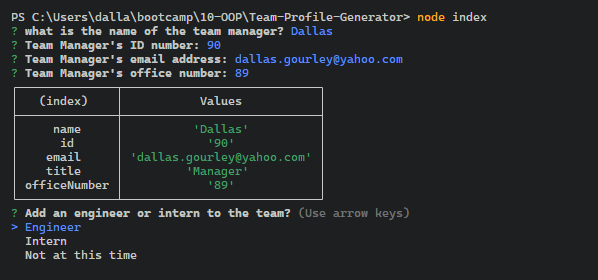
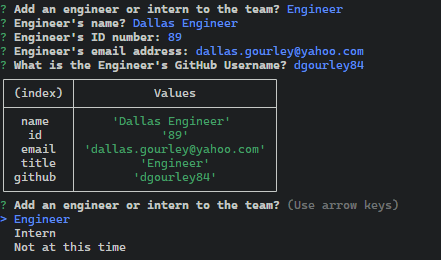
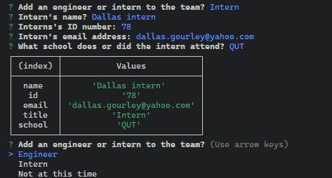
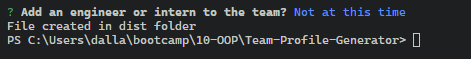
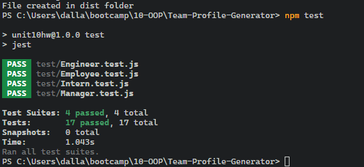

  
# Team Profile Generator

  A software engineering team-generator command line application. The application will prompt the user for information about the team manager and then information about the team members. The user can input any number of team members, and they may be a mix of engineers and interns. Then an HTML page is created that can be easily viewed in a web browser.

  [](https://opensource.org/licenses/MIT)

  Team-Profile-Generator

  [A deployed version can be viewed here.](N/A)

  [The repository can be viewed here.](https://github.com/dgourley84/Team-Profile-Generator)

  ---
## Contents
1. [About](#about)
    1. [Usage](#usage)
    2. [User Story](#user-story)
    3. [Acceptance criteria](#acceptance-criteria)
    4. [Visuals](#visuals)
2. [Installation](#installation)
3. [License](#license)
4. [Contributing](#contributing)
5. [Tests](#tests)
6. [Authors and acknowledgment](#authors-and-acknowledgments)
7. [Questions](#questions)
---
## About

  A software engineering team-generator command line application. The application will prompt the user for information about the team manager and then information about the team members. The user can input any number of team members, and they may be a mix of engineers and interns. Then an HTML page is created that can be easily viewed in a web browser.

---
## Usage
  
  As per the visuals upon running the file the user will be requested to input a number of fields in a questionaire to create a roster of a software dev team. This roster will be rendered in html file in the dist folder.

  A video of the usage of the file is available at the following link:

  https://drive.google.com/file/d/1sGzuoYQ67MUOlnaOH6ct_ju1AyIOY47j/view
  

---
## User Story
  
  ```md
AS A manager
I WANT to generate a webpage that displays my team's basic info
SO THAT I have quick access to their emails and GitHub profiles
```

---
## Acceptance Criteria
  ```md
GIVEN a command-line application that accepts user input
WHEN I am prompted for my team members and their information
THEN an HTML file is generated that displays a nicely formatted team roster based on user input
WHEN I click on an email address in the HTML
THEN my default email program opens and populates the TO field of the email with the address
WHEN I click on the GitHub username
THEN that GitHub profile opens in a new tab
WHEN I start the application
THEN I am prompted to enter the team manager’s name, employee ID, email address, and office number
WHEN I enter the team manager’s name, employee ID, email address, and office number
THEN I am presented with a menu with the option to add an engineer or an intern or to finish building my team
WHEN I select the engineer option
THEN I am prompted to enter the engineer’s name, ID, email, and GitHub username, and I am taken back to the menu
WHEN I select the intern option
THEN I am prompted to enter the intern’s name, ID, email, and school, and I am taken back to the menu
WHEN I decide to finish building my team
THEN I exit the application, and the HTML is generated
```
  
---
## Visuals:
  Below is mockup of final version - this is a place holder while bugs in the render of the html are solved.

  

  

  

  

  

  

---
## Installation:
  To clone the repo:

  ```bash
  git clone git@github.com:dgourley84/Team-Profile-Generator.git
  ```

  Run 'npm install' to install dependencies

  Run 'node index.js' to run program

  ```bash
node index.js
```


  Open the 'team.html' file from the output folder in a web browser to view
---
## License
  License used for this project - MIT
  * For more information on license types, please reference this website
  for additional licensing information - [https: //choosealicense.com/](https://choosealicense.com/).
---

## Contributing:

  To contribute to this application, create a pull request.
  Here are the steps needed for doing that:
  - Fork the repo
  - Create a feature branch (git checkout -b NAME-HERE)
  - Commit your new feature (git commit -m 'Add some feature')
  - Push your branch (git push)
  - Create a new Pull Request
  Following a code review, your feature will be merged.

---

## Tests:

  There are also unit tests to help you build the classes necessary.

    It is recommended that you follow this workflow:

    1. Run tests
    2. Create or update classes to pass a single test case
    3. Repeat

    You can run the tests any time with:

    "npm test"

---
## Authors & Acknowledgments

  Dallas Gourley

---

## Questions:
* GitHub Username: [dgourley84](https://github.com/dgourley84)
* GitHub Email: (dallas.gourley@yahoo.com)


